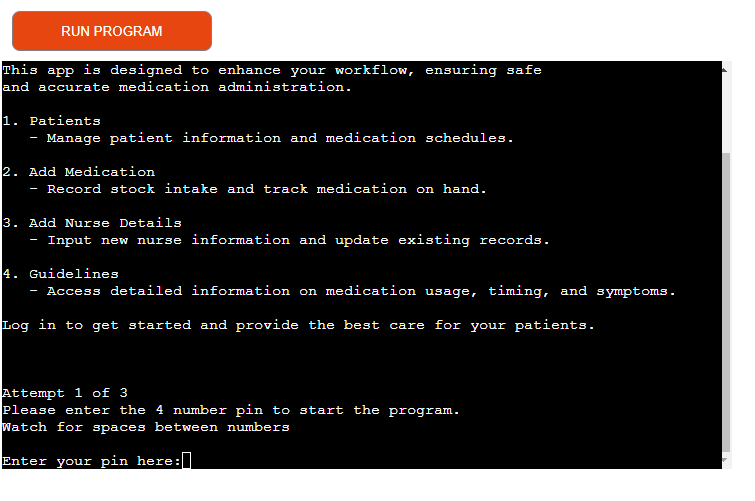
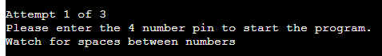
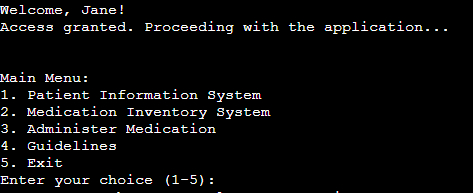
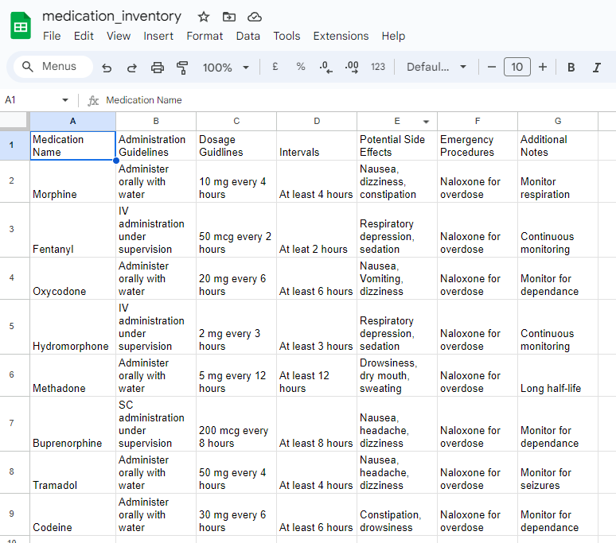
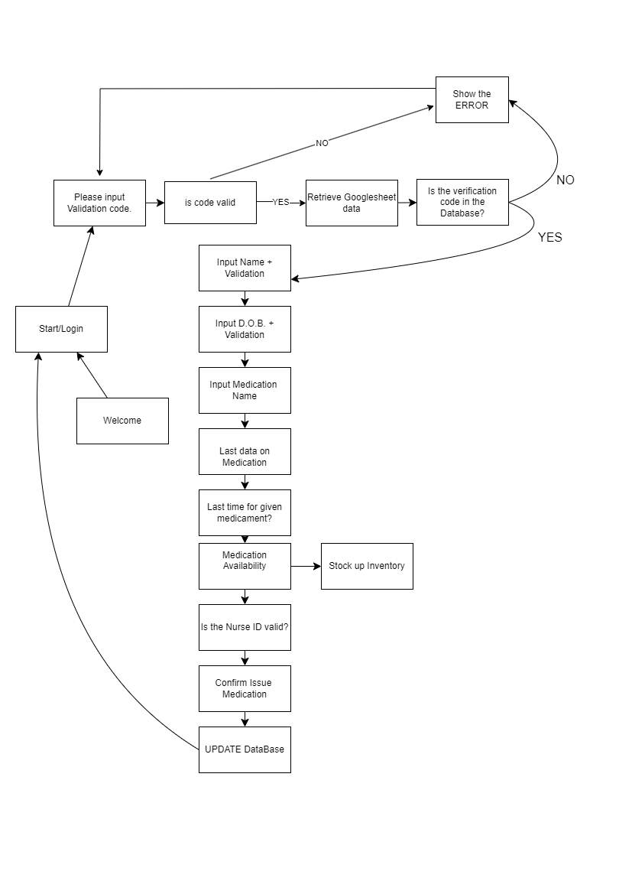

---

**Welcome to the Medication Administration App**

Effortlessly manage patient medication schedules and records. This app is designed to enhance your workflow, ensuring safe and accurate medication administration.

1. **Patients**
   - Manage patient information and medication schedules.

2. **Add Medication**
   - Record stock intake and track medication on hand.

3. **Add Nurse Details**
   - Input new nurse information and update existing records.

4. **Guidelines**
   - Access detailed information on medication usage, timing, and symptoms.

Log in to get started and provide the best care for your patients. This app is simple, quick, and easy to learn, providing crucial support for busy nurses in administering important medications, such as opioids, for pain therapy.

---

### How to Use the App:

1. Click this *[link](https://animatedwaffle-63fa727753ef.herokuapp.com/)* or copy and paste the URL into your browser's address bar.
2. Once the page loads, click 'RUN PROGRAM'.
3. Nurses can log in using a 4-digit code. Examples of codes: "1111", "1234", "9999", "2424".
4. All codes are listed in this [Google spreadsheet](https://docs.google.com/spreadsheets/d/1SM3qQY2PKeNK9HjMXGFhc5EBsrCLNd6P1hGbmDvchVk/edit?pli=1&gid=580694856#gid=580694856).
5. Each code is linked to a nurse's name. After logging in, the app will display a welcome message for the nurse.
6. Enter your pin code under "Enter your pin here". For example, entering "1111" logs in Nurse Jane.
7. You will be presented with a "Main Menu" with options 1-5.
8. Select an option by entering a number between 1 and 5. For example, selecting '1' will take you to the "Patient Information System".

### Main Menu Options:

1. **Patient Information System:**
   - View all patients
   - Search for a patient
   - Add a new patient
   - Return to main menu

2. **Medication Inventory:**
   - Display all medication
   - Update medication
   - Return to main menu

3. **Administer Medication:**
   - Enter patient's surname, e.g., "Jones". If there are multiple patients with the same surname, the app will prompt you to select the specific patient by number.

4. **Guidelines:** 
   - Access reminders on medication frequency, symptoms, and overdose management.

5. **Exit:**
   - Exit the application. 

Most menu options are functional, but some are planned for future updates.

---

### User Stories

#### First Time Visitor Goals:

- Quickly understand the app's primary purpose.
- Navigate easily to find content.
- Use the app to meet expectations as a nurse, aiding in documentation and medication administration.

#### Frequent Visitor Goals:

- Become faster and more efficient with reliable tools.
- Eliminate the need for paper folders and pens.
- Access up-to-date patient information and medication records on all station devices.
- Provide doctors with real-time updates on patient pain management.
- Ensure compliance with opioid handling laws through accurate and timely records.

---

### Features

- **Welcome Message:** Engages users to enter their nurse pin.
- **User Pin Entry:** Sends a personalized welcome message and grants access.
- **Menu Navigation:** Users can choose from various options to manage patients, medication inventory, and guidelines.
- **Logging:** Tracks user activity with date, time, and user details for security and compliance.

---

### Flowchart

The flowchart represents the logic of the application:

---

### Technologies Used

#### Languages:

- **Python 3.8.5:** Core language for application behavior.
- **JavaScript:** Provides the start script for running the mock terminal in the browser.
- **HTML:** Constructs elements for the mock terminal.

#### Frameworks/Libraries:

- **Python Modules:**
  - **Standard Library Imports:** `random`, `os`.
  - **Third-Party Imports:** `NLTK Package`, `Pattern Package`, `Simple Terminal Menu`, `Colorama`.
- **Tools:**
  - **Gitpod:** Main tool for writing and editing code.
  - **GitHub:** Hosts the project code.
  - **GIMP:** Resizes images for documentation.
  - **Draw.io:** Creates flowcharts.
  - **Heroku:** Deploys the project.

---
